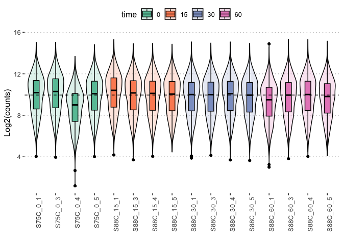
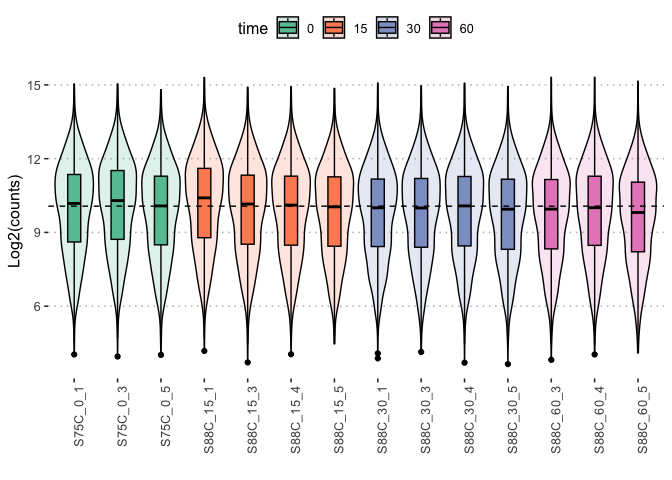
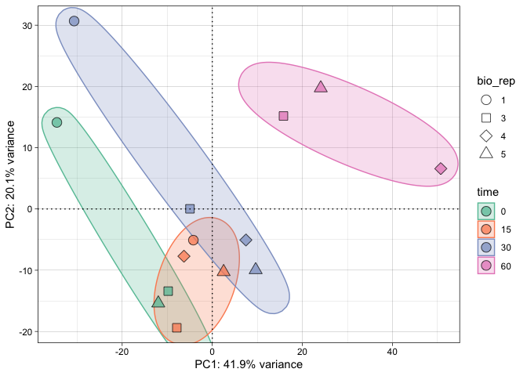
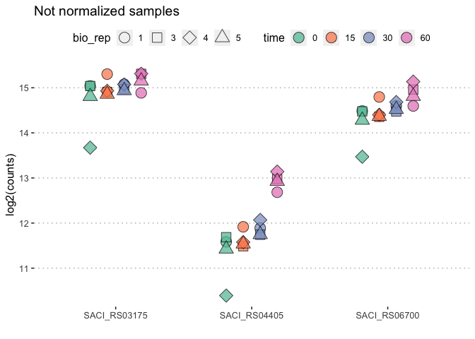
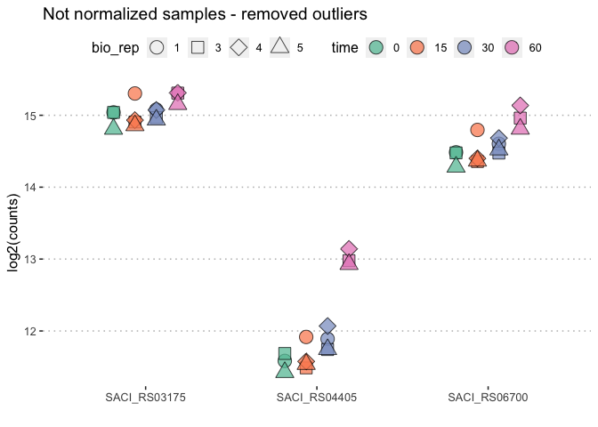

Differential protein expression analysis with DEqMS
================

- <a href="#deqms-workflow" id="toc-deqms-workflow">DEqMS workflow</a>
  - <a href="#read-in-input-data" id="toc-read-in-input-data">Read in input
    data</a>
    - <a href="#proteomics-data" id="toc-proteomics-data">Proteomics data</a>
    - <a href="#experiment-design-table"
      id="toc-experiment-design-table">Experiment design table</a>
  - <a href="#pca" id="toc-pca">PCA</a>
    - <a href="#all-data" id="toc-all-data">All data</a>
    - <a href="#after-removing-outliers"
      id="toc-after-removing-outliers">After removing outliers</a>
  - <a href="#normalisation" id="toc-normalisation">Normalisation</a>
    - <a href="#before-normalisation" id="toc-before-normalisation">Before
      Normalisation</a>
    - <a href="#equal-median-normalisation"
      id="toc-equal-median-normalisation">Equal median normalisation</a>
  - <a href="#deqms" id="toc-deqms">DEqMS</a>
    - <a href="#make-design-contrast" id="toc-make-design-contrast">Make
      design contrast</a>
    - <a href="#analysis" id="toc-analysis">Analysis</a>
    - <a href="#write-data-to-file" id="toc-write-data-to-file">Write data to
      file</a>
  - <a href="#hsp-plots" id="toc-hsp-plots">HSP plots</a>

# DEqMS workflow

[DEqMS](10.1074/mcp.TIR119.001646) is a robust statistical method
developed specifically for differential protein expression analysis in
mass spectrometry data. The method allows a more accurate estimation of
protein variance without increasing false discoveries.  
The described workflows were specifically applied to quantify tandem
mass tag (TMT)-labeled data.  
DEqMS is available as an [R
package](https://www.bioconductor.org/packages/devel/bioc/vignettes/DEqMS/inst/doc/DEqMS-package-vignette.html)
in Bioconductor.  
*Important info from the vignette:* **DEqMS builds on top of Limma, a
widely-used R package for microarray data analysis (Smyth G. et al
2004), and improves it with proteomics data specific properties,
accounting for variance dependence on the number of quantified peptides
or PSMs for statistical testing of differential protein expression.
Limma assumes a common prior variance for all proteinss, the function
spectraCounteBayes in DEqMS package estimate prior variance for proteins
quantified by different number of PSMs. **

## Read in input data

### Proteomics data

``` r
# load libraries 
library(here) 
library(tidyverse)
library(readxl)
library(data.table)
library(ggforce) 
library(ggpubr)
library(DEqMS)
library(writexl)
library(statmod)

# file location 
xl_file <- here("data/MS/EXT464_S1_newDB_with ratio per BR_RB_newlayout.xlsx")

# connect row number to locus tag 
xl_raw_info  <- read_xlsx(xl_file, range = cell_cols("A"),col_names = T) %>%
  rownames_to_column("row")

# "raw" count information in columns AG to AV, log2 transform data 
protein_raw_table <- left_join(xl_raw_info,
                          read_xlsx(xl_file, range = cell_cols("AG:AV"),col_names = T) %>%
                            rownames_to_column("row"),
                          by = "row") %>%
  dplyr::rename(locus_tag = 2) %>%
  dplyr::select(-row) %>%
  mutate_at(-1,as.numeric) %>%
  mutate_at(-1,log2) %>%
  drop_na() 

# PSMs
PSMs_table <- read_xlsx(xl_file, range = cell_cols(c("A:E")),col_names = T) %>%
  dplyr::rename(locus_tag = 1, count = 5) %>%
  dplyr::select(locus_tag, count)

psm.count.table = data.frame(count = PSMs_table$count, 
                            row.names =  PSMs_table$locus_tag)

# adjust column names to short sampled ids 
colnames(protein_raw_table)[-1] <- c(paste0("S", str_remove_all(str_split_fixed(colnames(protein_raw_table)[-1], "\\,", 5)[,c(5)], " "),
                                       "_", str_remove_all(str_split_fixed(colnames(protein_raw_table)[-1], "\\,", 5)[,c(4)], " "),
                                       "_", str_remove_all(str_split_fixed(colnames(protein_raw_table)[-1], "\\,", 5)[,c(3)], " ")))
```

### Experiment design table

A design table is used to tell how samples are arranged in different
groups/classes.

``` r
sample_info <- data.table(temp = c(rep("75", 4),
                                   rep("88", 12)),
                          bio_rep = rep(c(1,3,4,5),4),
                          time = c(rep(0,4), rep(15,4), rep(30,4), rep(60,4)),
                          name = c(paste0(rep("S75C_0_",4),c(1,3:5)),
                                   paste0(rep("S88C_15_",4),c(1,3:5)),
                                   paste0(rep("S88C_30_",4),c(1,3:5)),
                                   paste0(rep("S88C_60_",4),c(1,3:5))))
```

## PCA

Detect outliers using Principal Component analysis.

### All data

``` r
plot_PCA_sac <- function(inputDF, myInfo){
  ex <- inputDF
  pca <- prcomp(t(ex), scale = T)
  percentVar1 <- round(summary(pca)$importance[2,1]*100,1)
  percentVar2 <- round(summary(pca)$importance[2,2]*100,1)
  
  info <- myInfo
  
  plotDF <- pca$x %>%
    as.data.frame() %>%
    rownames_to_column("name") %>%
    left_join(info, by = "name") %>%
    dplyr::mutate(time = as.factor(time),
                  bio_rep = as.factor(bio_rep))
  
  ggplot(data = plotDF, 
         aes(x = PC1, y = PC2, fill = time)) +
    geom_mark_ellipse(aes(color = time, group = time), 
                      alpha = 0.25) +
    geom_point(size = 4, alpha = 0.75, aes(shape = bio_rep)) +
    scale_shape_manual(values = c(21:25)) +
    scale_fill_brewer(palette = "Set2") +
    scale_color_brewer(palette = "Set2") +
    guides(fill = guide_legend(override.aes = list(shape = 21))) +
    theme_linedraw() +
    xlab(paste0("PC1: ", percentVar1, "% variance")) +
    ylab(paste0("PC2: ", percentVar2, "% variance")) +
    geom_hline(yintercept = 0, linetype = "dotted") +
    geom_vline(xintercept = 0, linetype = "dotted") 
}

plot_PCA_sac(protein_raw_table[,-1], sample_info)
```

<!-- -->

### After removing outliers

``` r
to_long_f <- function(input_DF, info){
  input_DF %>%
    dplyr::mutate(locus_tag = info$locus_tag) %>%
    as_tibble() %>%
    pivot_longer(cols = -locus_tag) %>%
    left_join(sample_info, by = "name") %>%
    dplyr::mutate(time = as.factor(time),
                  bio_rep = as.factor(bio_rep))
}

# label outliers
rem_MS_pca <- data.table(bio_rep = c(4, 1),
                         time = c(0,60),
                         label = "remove")

# select columns, after removing outliers 
MS_remBAD_t <- sample_info %>%
  ungroup() %>%
  left_join(rem_MS_pca) %>%
  dplyr::filter(is.na(label)) %>%
  dplyr::select(-label) %>%
  dplyr::select(name) %>%
  deframe()

# dataframe with outliers removed
df_remBAD      <- as_tibble(protein_raw_table)[MS_remBAD_t]
df_remBAD_long <- to_long_f(df_remBAD, protein_raw_table)
```

## Normalisation

Why is normalisation necessary?

### Before Normalisation

``` r
long_t_plot <- function(inputDF){
  ggplot(data = inputDF %>% mutate(median_all = median(value)),
         aes(x = name, y = value, fill = time)) +
    geom_violin(alpha = 0.2, color = "black") +
    geom_boxplot(width = 0.3, color = "black") +
    theme_pubclean() +
    scale_fill_brewer(palette = "Set2") +
    ylab("Log2(counts)") +
    geom_hline(aes(yintercept = median_all), 
               linetype = "dashed", size = 0.5) +
    xlab("") +
    theme(axis.text.x = element_text(angle = 90, hjust = 1))
}

protein_raw_table_long <- to_long_f(protein_raw_table,protein_raw_table)

# distribution plot 
## before outliers removed
long_t_plot(protein_raw_table_long)
```

<!-- -->

``` r
## after 
long_t_plot(df_remBAD_long)
```

<!-- -->

``` r
# check PCA after removing outliers (without normalisation) 
plot_PCA_sac(df_remBAD, sample_info)
```

<!-- -->

### Equal median normalisation

The median normalization is based on the assumption that the samples of
a data set are separated by a constant. It scales the samples so that
they have the same median. The method calculates for each sample the
median change (i.e. the difference between the observed value and the
row average) and subtracts it from each row. The new median of each
sample is 0.

``` r
# normalise data & connect locus tags as row names
df_remBAD_Med <- equalMedianNormalization(df_remBAD)

rownames(df_remBAD_Med) <- protein_raw_table$locus_tag

df_remBAD_Med_long <- to_long_f(df_remBAD_Med, protein_raw_table)

# distribution plot 
long_t_plot(df_remBAD_Med_long)
```

<!-- -->

``` r
# check PCA after removing outliers (with equal median normalisation) 
plot_PCA_sac(df_remBAD_Med, sample_info)
```

<!-- -->

## DEqMS

### Make design contrast

In addition to the sample design, we need to define the contrast, which
tells the model to compare the differences between specific groups.

``` r
cond1  <- colnames(df_remBAD_Med)
cond2  <- substr(cond1,1,nchar(cond1)-2)
design <- model.matrix(~0+cond2)
colnames(design) <- str_remove_all(unique(cond2), "cond")
levels <- unique(cond2)
fit1   <- lmFit(df_remBAD_Med, design)
fit1_genes <- rownames(df_remBAD_Med)
```

### Analysis

``` r
DEqMS_MS <- function(set1, set2){
  
  id <- unique(str_sub(sample_info$name, 1, nchar(sample_info$name)-2))
  
  final <- paste(set1,set2, sep = " - ")
  contrast_cmd <- paste("tmp <- makeContrasts(",final, ",levels = colnames(coef(fit1)))",sep='"')
  contrast <- eval(parse(text = contrast_cmd))
  
  fit <- eBayes(contrasts.fit(fit1,contrasts = contrast), 
                robust = TRUE,trend = TRUE)
  
  fit$count = psm.count.table[rownames(fit$coefficients),"count"]
  fit_output = spectraCounteBayes(fit)
  
  output <- outputResult(fit = fit_output,coef_col = 1) %>%
    rownames_to_column("locus_tag") %>%
    as_tibble() %>%
    mutate(logFC = -logFC) %>%
    mutate(type_reg = case_when(logFC <= 0 & adj.P.Val < 0.05 ~ "down",
                                logFC >=  0 & adj.P.Val < 0.05 ~ "up",
                                adj.P.Val > 0.05 ~ "rest")) %>%
    as_tibble() %>%
    dplyr::rename(padj = adj.P.Val, pval = `P.Value`) %>%
    dplyr::select(logFC, locus_tag, padj,pval) %>%
    dplyr::mutate(!!paste("logFC",id[i+1], sep = "") := logFC,
                  !!paste("padj",id[i+1], sep = "") := padj,
                  !!paste("pval",id[i+1], sep = "") := pval) %>%
    dplyr::select(-logFC, -padj, -pval) 
  
  return(output)
}

deqms_small      <- data.table()
deqms_table_MS   <- data.table(locus_tag = fit1_genes)

for(i in 1:(length(levels)-1)){
  deqms_small <- DEqMS_MS(levels[1],levels[i+1]) 
  deqms_table_MS <- left_join(deqms_table_MS, deqms_small, by = "locus_tag")
}
```

### Write data to file

``` r
write_xlsx(deqms_table_MS, here("tables/DEqMS_PSM.xlsx"), col_names = T)
```

## HSP plots

``` r
# functions ----
point_plot_fac <- function(DF, ylabN,plotname){
  DF %>%
    dplyr::filter(locus_tag %in% hsp_list) %>%
    ggplot(aes(y = (value),x = locus_tag, fill = time, group = time, shape = bio_rep)) +
    geom_jitter(size = 5, color = "black",position = position_dodge(width = 0.5), alpha = 0.75) +
    scale_shape_manual(values = c(21,22,23,24)) +
    scale_fill_brewer(palette = "Set2") +
    theme_pubclean() +
    guides(fill = guide_legend(override.aes = list(shape = 21))) +
    xlab("") +
    ylab(ylabN) +
    ggtitle(plotname)
}

# data ----
# specific genes 
## SACI_RS06700: Thermosome alpha  
## SACI_RS03175: Thermosome beta
## SACI_RS04405: Small HSP
hsp_list <- c("SACI_RS06700", "SACI_RS03175", "SACI_RS04405")

point_plot_fac(protein_raw_table_long, "log2(counts)", "Not normalized samples") 
```

<!-- -->

``` r
point_plot_fac(df_remBAD_long, "log2(counts)", "Not normalized samples - removed outliers") 
```

<!-- -->

``` r
point_plot_fac(df_remBAD_Med_long, "Median normalized log2(counts)", "Equal median") 
```

<!-- -->
